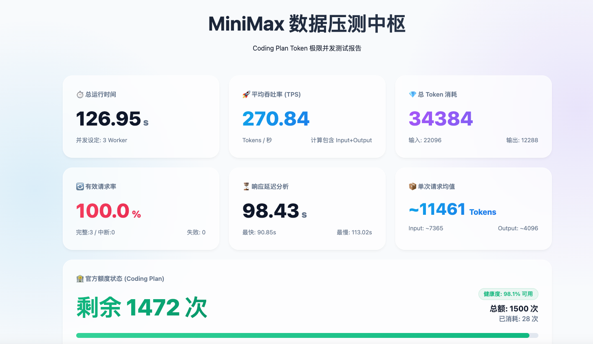

# MiniMax Coding Plan 流式 Token 压测工具



一个用于测试 MiniMax API 流式输出能力的压测工具，支持高并发请求、实时状态监控和自动生成 HTML 报告。

## 功能特性

- **流式 API 调用**：测试流式输出的稳定性
- **高并发支持**：默认 3 个 Worker 并发请求
- **极限输出测试**：最大支持 4096 tokens 输出
- **实时状态监控**：显示活跃请求数、Token 吞吐率、响应延迟等
- **额度查询**：自动查询 Coding Plan 剩余次数
- **HTML 报告**：按 Ctrl+C 停止后自动生成美观的可视化报告

## 环境要求

- Python 3.7+
- requests 库

安装依赖：

```bash
pip install requests
```

## 配置

在运行前需要设置环境变量或修改代码中的配置：

| 变量 | 说明 | 默认值 |
|------|------|--------|
| `ANTHROPIC_AUTH_TOKEN` | API Key（以 sk- 开头） | 无（必填） |
| `ANTHROPIC_BASE_URL` | API 基础 URL | `https://api.minimaxi.com/anthropic` |
| `ANTHROPIC_MODEL` | 模型名称 | `MiniMax-M2.5` |

### 设置 API Key

```bash
# 方式一：环境变量
export ANTHROPIC_AUTH_TOKEN="你的API_KEY"

# 方式二：直接修改 run.py 中的 API_KEY 变量
```

## 使用方法

```bash
python run.py
```

运行后：
1. 工具会自动启动多个并发 Worker
2. 每 10 秒打印一次实时状态
3. 按 **Ctrl+C** 停止测试
4. 自动生成 HTML 报告并在浏览器中打开

## 输出说明

### 实时状态示例

```
=================================================================
📊 实时压测状态 (10.0s)  |  🏃‍♂️ 正在生成中: 3 个
✅ 完整成功: 5 | ⚠️ 中断有效: 1 | ❌ 失败: 0
📥 In: 1500 | 📤 Out: 20480
🚀 Token 吞吐率: 2198.00 tokens/s
🏦 官方额度: 🟢 剩余 1400 次 / 总额 1500 次 (已消耗 100 次)
=================================================================
```

### HTML 报告

停止后会自动生成 `minimax_report.html`，包含：
- 总运行时间
- 平均吞吐率 (TPS)
- 总 Token 消耗
- 有效请求率
- 响应延迟分析
- 官方额度状态

## 配置参数

在 `run.py` 中可以调整以下参数：

```python
CONCURRENCY = 3          # 并发 Worker 数量
MAX_TOKENS_OUTPUT = 4096 # 最大输出 tokens
```

## 注意事项

- 请确保 API Key 余额充足
- 高并发可能触发速率限制，工具会自动退避重试
- 生成的 HTML 报告保存在当前目录的 `minimax_report.html`
